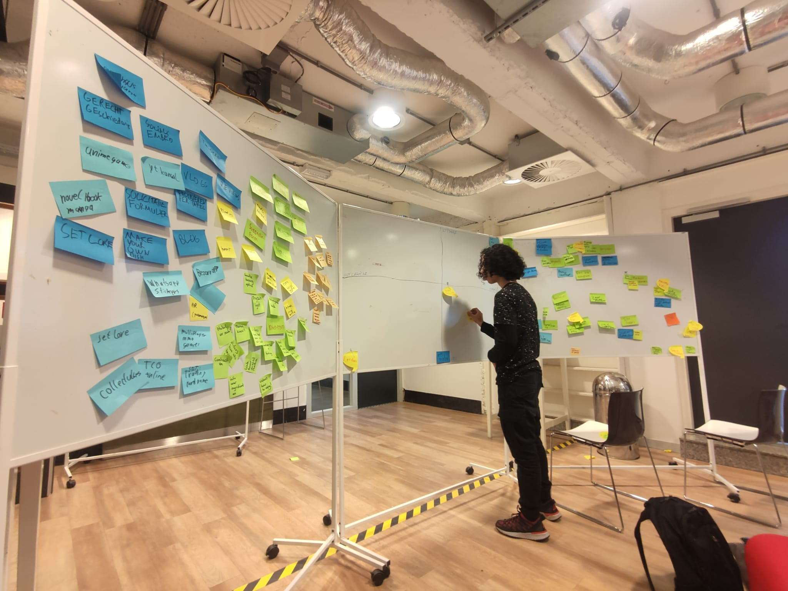
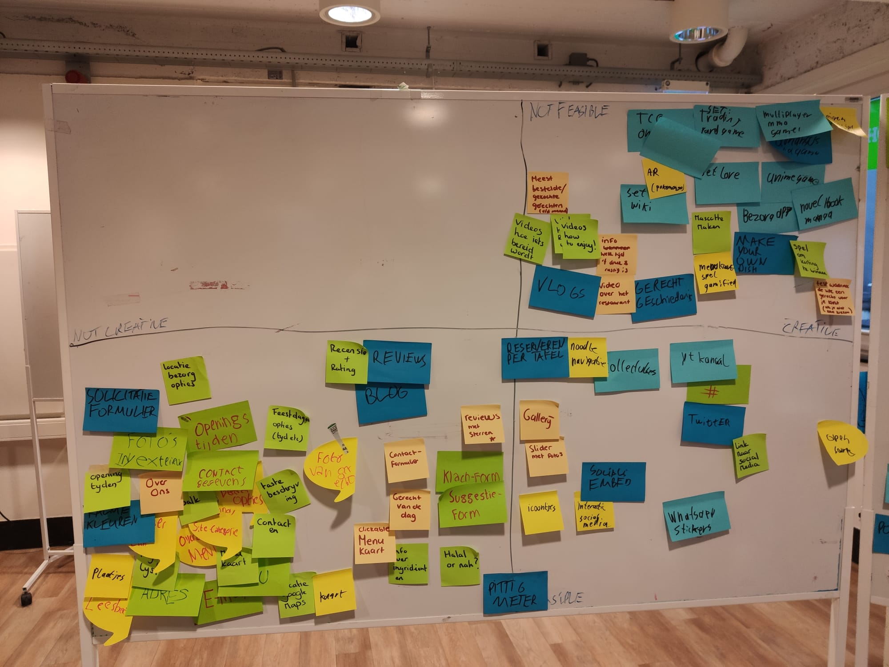
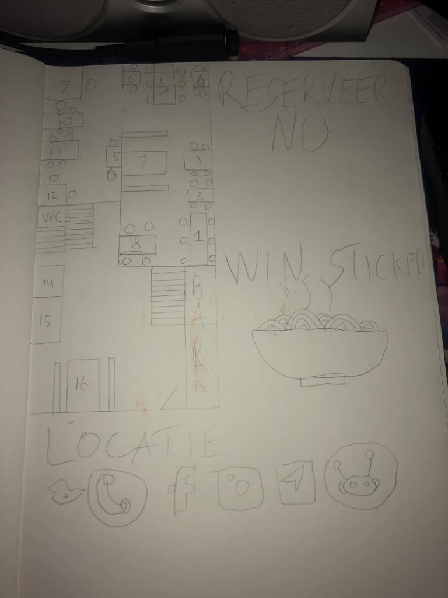

# Concepten block
Voor het concepten block heb ik gekozen om mijn ontwerpopdracht bij het restaurant SET te kiezen. Ik heb als ontwerpopdracht om een site te maken voor SET Rotterdam. 

## Brainstorm
Ik heb in totaal 3 brainstormsessies gehouden.

### [Mind Mappen](https://youtu.be/anw32Javtvk)
 Voor mijn eerste brainstormsessie ging ik mind mappen. Ik had een lokaal geregeld en een smartboard. Ik heb mijn teamgenoot en nog een klasgenoot uitgenodigd voor de brainstorm. Ik heb voor de mind mapping methode gekozen omdat ik dacht dat de methode goed zou zijn om veel verschillende ideëen op te wekken die ook bij elkaar passen. Echter vond ik de brainstorm niet zo goed gaan als ik had gehoopt. Ik hoopte om veel ideëen te verzinnen en daarbij ook wat meer unieke ideëen. Als ik kijk naar het resultaat van mijn brainstorm heb ik een goed aantal ideën waarmee ik de site kan maken. Ik had dus veel ideën gekregen voor een beetje de basis functionaliteiten maar niet de dingen de site leuker zou maken of interessanter. Ik geloof dat dit komt doordat mind mappen niet de beste methode hiervoor was of omdat ik de mind map methode niet goed heb toegepast. Ik denk dat het mind mappen beter had gekund door meer te tekenen en plaatjes te maken. Iets wat een beetje raar of moeilijk kan zijn om te visualiseren bij bedenken van extra functionaliteiten. Verder denk ik dat ik het niet helemaal correct heb toegepast doordat er bijvoorbeeld niet genoeg ruimte was op het boord of doordat er niet genoeg kleuren waren. Ook denk ik dat ik als organisator niet genoeg heb uitgelegd wat het doel was van de brainstorm. 

 Ik denk dat als ik nog een keer zou brainstormen dat ik eerst zou dubbel checken of mind mappen wel de beste methode hiervvoor is. Verder zou ik beter voorbereiden door betere spullen te regelen of meer bekend te worden met de spullen die ik heb gebruikt zoals de smartboard. Ook zou ik voortaan meer uitleg kunnen geven over de brainstorm methode die we gebruiken en de context van waarom we brainstormen.

 ### [Rapid Ideation](https://youtu.be/3MGxvhj_uYo)
 Zelf ben ik een fan van rapid ideation omdat je veel gekke ideëen ermee kan verzinnen. Deze keer heb ik voor de brainstorm een plek gevonden op de 5e verdieping met lekker veel whiteboards, ook heb ik stickies en markers voorbereid. Uiteindelijk bleek dat we heel veel ideëen hebben verzonnen en dat ik misschien niet genoeg stickies had voorbereid. Verder heb ik voor deze brainstorm meer klasgenoten uitgenodigd waardoor we nu met zijn vijven waren. Ik vond de brainstorm deze keer heel goed gaan. Ik begon met het uitleggen van de methode wat de regels waren en wat het doel was. Ook gaf ik meer context over de site en de opdrachtgever. Het boord was uiteindelijk bijna helemaal vol met ideëen en we hadden bijna niet genoeg stickies voor de volgende brainstormmethode. Ik vond rapid ideation hele goede methode om te gebruiken in dit scenario. Omdat er met deze methode veel bijzondere ideëen bereikt kunnen worden. Ideën die dom lijken kunnen bijvoorbeeld verbeterd worden of worden niet zo dom gezien als je dacht dat ze waren.

 Als ik weer rapid ideation zou gebruiken zou ik de volgende keer meer stickies voorbereiden. Verder vond ik alles helemaal goed gaan, behalve dat het filmen niet helemaal lukte. Ik heb jammer genoeg maar de eerste 3 minuten van de rapid ideation brainstorm.

Hier is een foto van toen we de COCD box gingen maken, de rapid ideation boord is aan de linkerkant en is helemaal vol.

 ### [Reverse Brainstorm](https://youtu.be/vcB70CciYwo) en de [Reverse Brainstorm oplossingen](https://youtu.be/-wtgSj6qJLQ)
Vlak na de rapid ideation brainstorm hield ik een reverse brainstorm. Hier heb ik alleen uitgelegd hoe de brainstorm werkte. Jammer genoeg begon het te kort aan stickies duidelijk te worden. Toen de ideëen voor problemen een beetje op begonnen te raken besloot ik dat we met zijn allen oplossingen gingen bedenken voor de problemen die we hebben verzonnen. Wat ik wel heb gemerkt is dat de problemen die we verzonnen vaak op elkaar leken of met dezelfde oplossing konden worden opgelost. Of we hebben heel erg simpele opllosingen verzonnen die niet specifiek genoeg waren. Uiteindelijk hebben we een duidelijk beeld gevormd van wat de site niet zou moeten hebben en hoe we dat moeten voorkomen. Ik denk dat de brainstorm aardig goed ging alleen was het misschien niet het beste idee om 2 brainstormsessies achter elkaar te houden. Ik denk dat we wel allemaal een beetje moe begonnen te worden. Ik vind reverse brainstorming ook wel passen. Ik vind het leuk dat het je een beetje don'ts geeft, ik betwijfel wel of ik de methode goed heb toegepast omdat er uit deze brainstorm ook niet veel nieuwe interacties kwamen maar meer guidelines.

Volgende keer als ik 2 brainstormsessies achter elkaar plan zal ik ervoor zorgen om een pauze er tussen te houden. Ook denk ik dat het in het algemeen beter is om tijdslimitien toe te voegen aan een brainstorm. Voor de reverse brainstorm heb ik het niet gedaan, maar ik denk dat het toevoegen een extra doel toevoegt en dat is om zoveel mogelijk ideën te verzinnen voor het tijdslimiet.

## Keuze concept
Uiteindelijk heb ik een alle ideëen in een COCD-box verwerkt.

In de COCD-box zie je dat we met veel creatieve ideëen zijn gekomen die niet haalbaar zijn. Ook hebben we heel veel ideëen die haalbaar zijn maar niet creatief. Deze ideëen zijn ook een beetje de must haves van de site, zonder deze ideëen zou die site niet echt voldoen als een site van een restaurant. Dan zijn rechtsonder de creatieve ideëen die ook haalbaar zijn. Als ik kijk naar alle creative haalbare ideëen vind ik de ideëen voor het reserveren per tafel, de collectibles en de whatsapp stickers het leukst. Daarom wil ik ze verwerken in één nieuw idee. Als je reserveerd kan je voor elke tafel een unieke WhatsApp sticker krijgen. Ik kies voor dit concept omdat het een extra element toevoegt aan het reserveren, ook werkt het complimentair met het systeem waar je per tafel kan reserveren omdat je aan spoort om een bepaalde tafel te reserveren voor de collectible die je kan krijgen.

## Concept poster
Ik heb eerst een snelle schets gemaakt van de poster.

