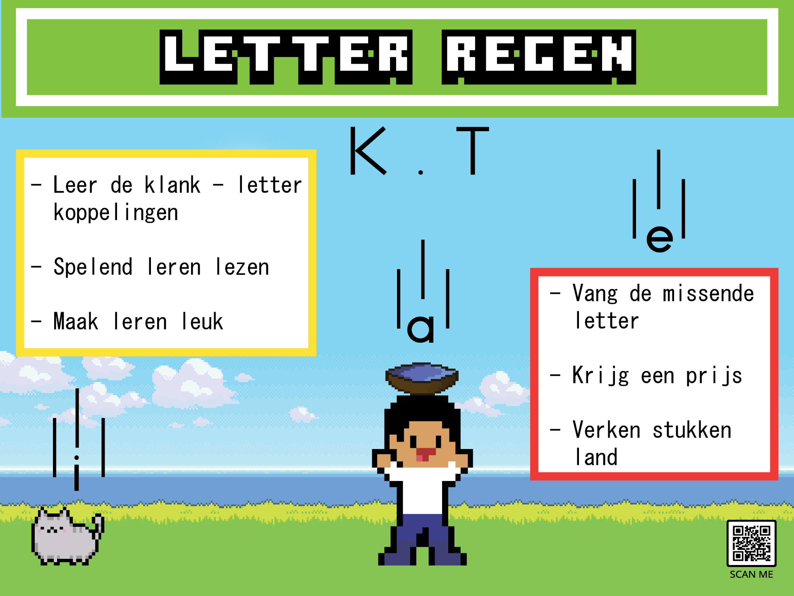
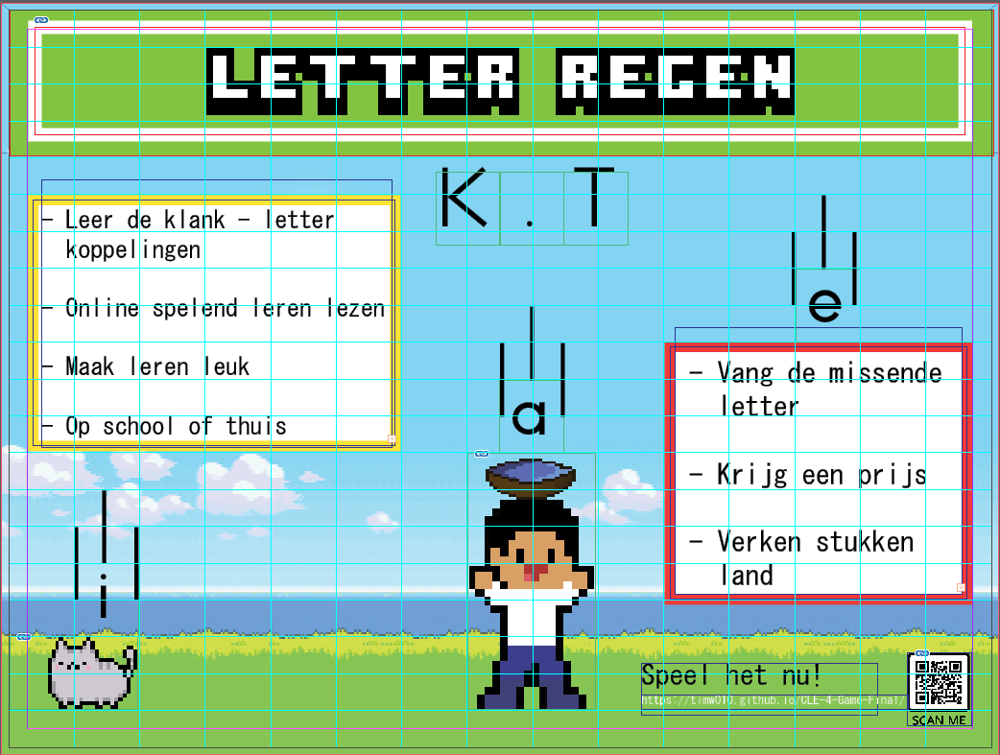

# Content block
## Afstemming

## Doelgroep

## Visuals

## Helder

## Structuur

## Taal als tool
---

**Op donderdag 8 juli 2021 had je een beoordeling voor dit block. Helaas was het nog niet voldoende. Noteer hierboven, bij de uitdaging(en) die van toepassing zijn, de aanvulling op de leeswijzer voor de herkansing. Neem hierin de feedback van de eerdere poging mee.**

**Laat de inhoud hieronder staan:**

## Afstemming

Met een team heb ik voor CLE 4 een game gemaakt die kinderen helpt met kinderen enthousiast houden voor het leren van de klank-letter koppelingen. Dit product wil ik marketen naar ouders en leraren, omdat zij uiteindelijk bepalen of een kind het gaat spelen. Maar ik wil dat mijn poster er ook nog leuk uitziet voor de kinderen en ouders omdat het een poster voor een spel is. Mijn poster weergeeft hoe het spel ongeveer werkt. Je hebt ons karakter in het midden die de correcte letter probeert te vangen voor het woord kat. Kleuren die in de level selectie voor de game worden gebruikt komen ook terug in de poster. Ook heb ik de vijf W vragen beantwoord in mijn poster. In het gele blok staat wat onze game hoort te doen en in het rode vlak wat je moet doen in onze game. Verder is er een QR-code en een link naar onze game zodat je het spel meteen kan spelen, deze maken deel van mijn call to action om het spel nu te spelen.

## Doelgroep

Voor mijn project zijn er twee interviews gehouden, één met de opdrachtgevers en een extra interview met een juf uit groep 3. Uit deze interviews heeft mijn team veel informatie kunnen halen. Het belangrijkste van de interviews was aan wat voor eisen onze game zou moeten voldoen en wat onze game gaat doen. Dit heb ik verwerkt in het gele blok en dit is ook wel het blok dat waarschijnlijk als eerst gelezen wordt als de poster genoeg aandacht trekt. Verder heb ik hetzelfde soort taal gebruikt dat je vind op websites van andere lesmethodes en uitgevers, zoals Malberg, Heutink en Squla.  

## Visuals
Het lettertype is MS gothic, gothic fonts zijn familie van de sans-serif font. Deze behoren tot de meest leesbare fonts. Verder heb ik gelet op de achtergrond van alle tekst stukken, zodat ik zeker weet dat alle tekst leesbaar is. 

## Helder

Mijn poster is bijna volledig in het Nederlands. Er is alleen een QR-code waaronder staat scan me. Er zijn geen type of taalfouten zover ik weet.

## Structuur

Om voor een goede structuur en een goede flow te zorgen heb ik gebruik gemaakt van guides in Adobe Indesign, deze helpen met mij met zien welke gedeeltes van de posters te druk zijn en op welke hoogte ik alles moet zetten. 

Taal als tool
Ik heb momenteel nog maar één taal als tool badge, maar ik ben van plan binnen drie dagen nog één te halen.

