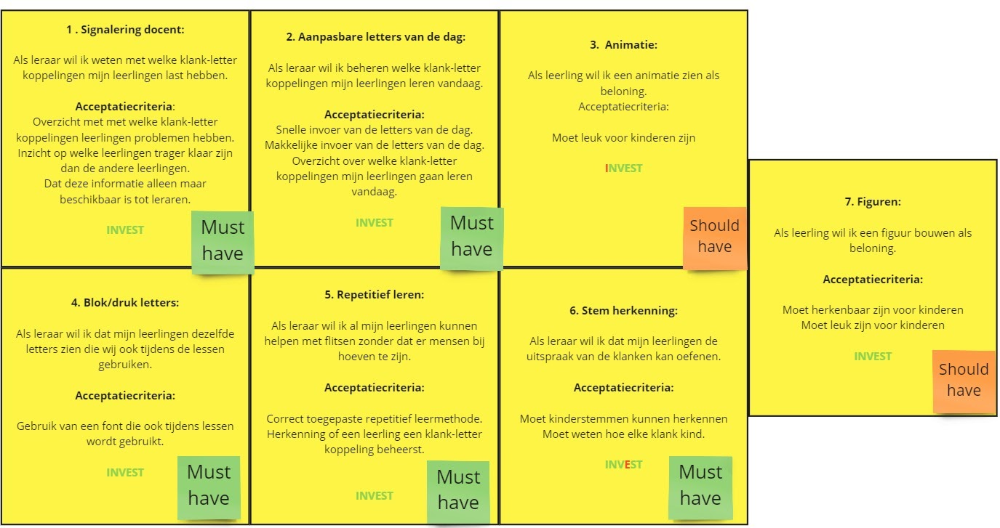
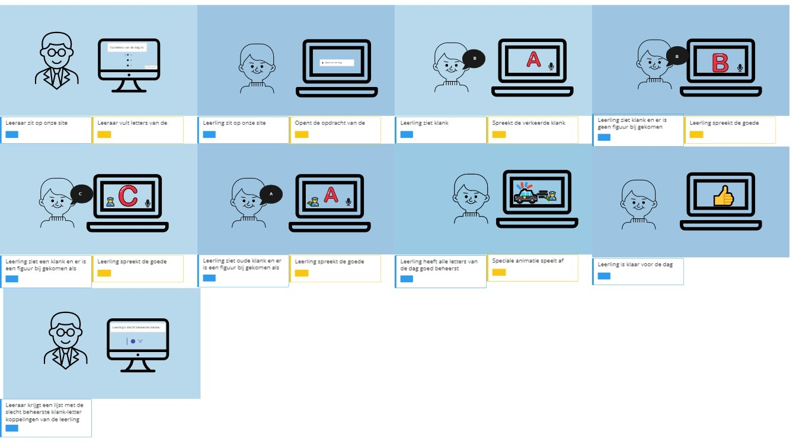
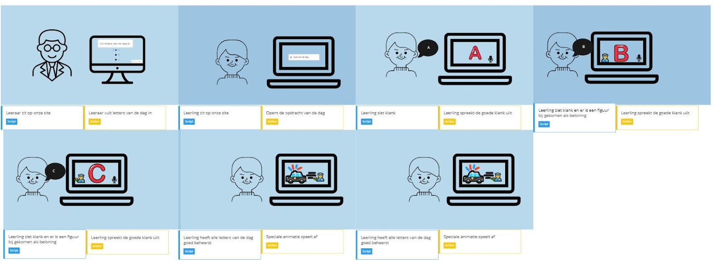
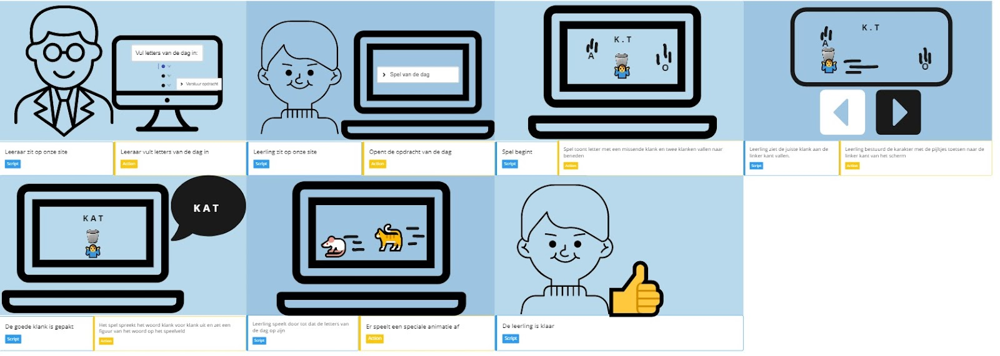
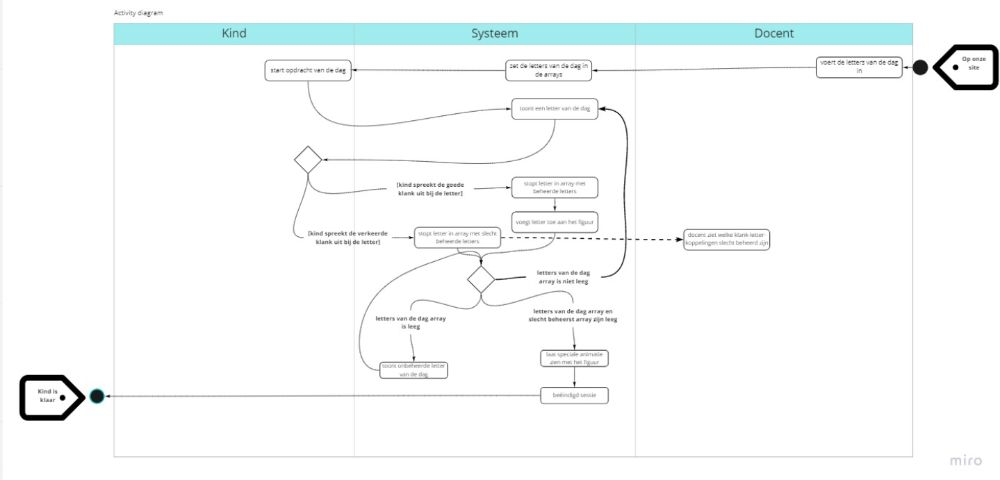
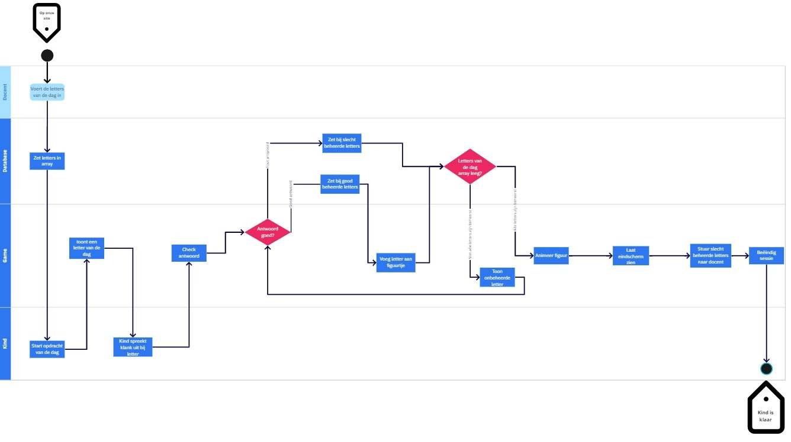
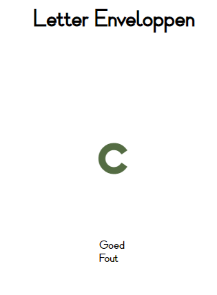
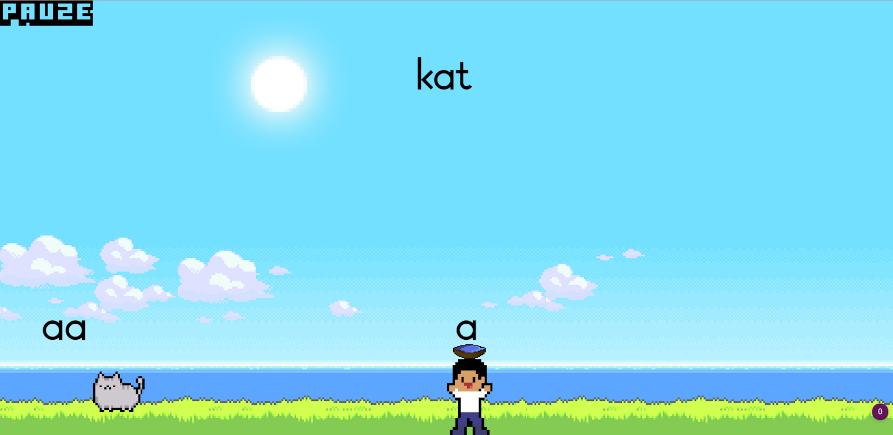
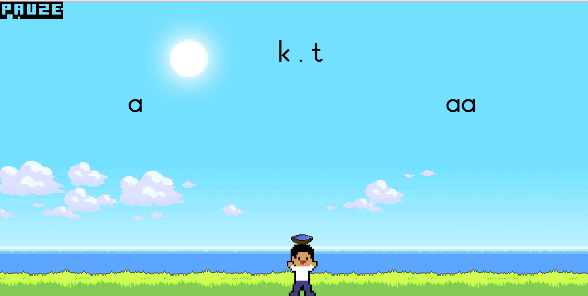

## Requirements

## Documentatiekennis

## Opstellen

## Uitvoeren
---

**Op woensdag 7 juli 2021 had je een beoordeling voor dit block. Helaas was het nog niet voldoende. Noteer hierboven, bij de uitdaging(en) die van toepassing zijn, de aanvulling op de leeswijzer voor de herkansing. Neem hierin de feedback van de eerdere poging mee.**

**Laat de inhoud hieronder staan:**

## Requirements

Voor CLE 4 hebben wij in een team games gemaakt om kinderen te helpen met het leren van de klank-letter-koppelingen. Om tot ons eerste concept te komen hebben wij meerdere interviews gehouden. Er is een interview gehouden met de opdrachtgevers Marjan en Ruud en er is een interview gehouden met een juf uit groep 3. Door de interviews heeft mijn team al een idee van wat ons eerste concept game gaat zijn. Wij willen werken met een repetitief leersysteem zoals Quizlet en Anki. Met ons eerste concept en de vereiste functionaliteiten van een educatief spel in gedachte. Heb ik user stories gemaak, zodat ons team weet aan welke functionaliteiten ons project moet voldoen. Verder zijn de user stories met INVEST en MoSCoW gecheckt. Door te checken met de INVEST methode kunnen we ervoor zorgen dat de user stories duidelijk en haalbaar zijn. Met de MoSCoW methode bepalen wij wat de belangrijkste functionaliteiten van onze project zijn. 

## Documentatiekennis
Een interactie ontwerp kan vele onderdelen bezitten, elk onderdeel is een tool om de interactie tussen de gebruiker en het systeem inzichtelijk te maken. Een interactie ontwerp kan aan de volgende onderdelen beschikken:

- Sitemap
- Wireframe
- Flowchart
- Wireflow
- Activity diagram
- Style guide
- Storyboard

### Sitemap:

Een sitemap is een weergave van alle pagina’s op je site en hoe jouw gebruikers naar die pagina’s kunnen komen. Vaak heeft een sitemap een boomstructuur. Met behulp van een goede sitemap kun je de structuur van jouw website maken, op een manier zodat het navigeren van jouw website een fijne ervaring is voor de gebruiker. 

### Wireframe:

Met een wireframe bepaal je de lay-out van je pagina’s. Op een wireframe zie je hoe de content en de functionaliteiten op een site zijn ingedeeld. Wireframes hebben ook annotaties die belangrijke functionaliteiten toelichten, dit is handig om te zien wat de functionaliteit is en wat er met die functionaliteit gebeurd indien je de wireframe aanpast. Met een wireframe zou je al vroeg feedback kunnen vragen zodat je bij het maken van de echte webpagina een goede lay-out hebt. Wireframes hebben verschillen in detail. Je begint vaak met een low fidelity wireframe deze zijn vaak van papier gemaakt of op een whiteboard getekend en voldoen aan minder details. Dit is handig omdat je dan makkelijk je wireframe kan aanpassen. Bij een high fidelity wireframe heb je vaak meer details en deze zijn ook vaker gemaakt met software. High fidelity wireframes bevatten vaak ook kleur en zien er ook al meer uit als wat jij gaat maken. 

### Flowchart:

Een flowchart is een diagram die het proces van een taak van de gebruiker laat zien. Stel je maakt een kleding site. Een user flow beeld in hoe een gebruiker bijvoorbeeld een kledingstuk zou kopen. Een gebruiker kijkt bijvoorbeeld naar de plaatjes en dan naar prijs en dan naar de beschrijving voordat die iets koopt. 

### Wireflow:

 Een wireflow is een combinatie van een wireframe en een flowchart. Een wireflow neemt de visuele aspecten van een wireframe en combineert die met de acties van een flowchart om een bepaald proces te weergeven.

### Activity diagram:

Een activity diagram is een soort geavanceerde versie van een flowchart. Een activity diagram laat zien hoe het systeem werkt, door het proces van de gebruiker en het systeem van start toe eind te laten zien. Inclusief de eventuele andere keuzes in het proces.

### Style guide:

In style guide zet je de guidelines voor hoe visuele elementen in het project er uit moeten zien. Dit helpt als er meerdere mensen aan één project werken, zo blijft de styling van het project overal hetzelfde.

### Story boards:

Een storyboard visualiseert als een soort stripverhaal hoe een gebruiker interacteert met jouw product. Het verteld een verhaal van hoe een gebruiker jouw product ervaart.

## Opstellen
[Alle devices in hoge kwaliteit zijn te vinden op miro.](https://miro.com/welcomeonboard/bG0yS1Y3WEJzZ2Nqc2tYN0VZTlRIcUlpbDdmaWFDN2taZjNmdHNEZkFudGlrMmFyZThJWXRuYlVSUGhjRjBSNHwzMDc0NDU3MzUwMDQ5NDI0NTA2)

## Uitvoeren
Als eerste concept hadden we een flitssysteem. Voor ons eerste concept heb ik drie activity diagram en twee storyboards gemaakt en ik heb gecheckt of mijn ontwerpen nog voldoen aan alle functionaliteiten. Ik heb drie activity diagrams gemaakt door de feedback op mijn eerste activity diagram, deze was nogal slordig en onoverzichtelijk. Daarom heb ik twee nieuwe gemaakt waarbij eentje ook nog de database scheid van het spel.

Ons eerste prototype was heel simpel en vereiste nog dat er iemand bij was om te checken of de klank goed uitgesproken werd, er was ook nog geen fun factor toegevoegd. Het was dus alleen nog een flits programma. Voor ons tweede prototype hebben we ons concept een klein beetje aangepast, en we hebben de functie om kinderen de klank uit te laten spreken en het repetitief leren laten vallen. Op basis van ons aangepaste concept en feedback op de eerste storyboards heb ik een nieuwe storyboard gemaakt. Bij het maken van de storyboard voor het tweede concept, probeerde ik mijn storyboard wat leuker te maken en meer verhaal te geven. Mijn eerste storyboard was ook wel een beetje saai, daarom heb ik meer perspectieven geprobeerd toe te voegen aan mijn nieuwe storyboard. Uiteindelijk is dit ons eindproduct, het is te spelen op https://timw010.github.io/CLE-4-Game-Final/.

