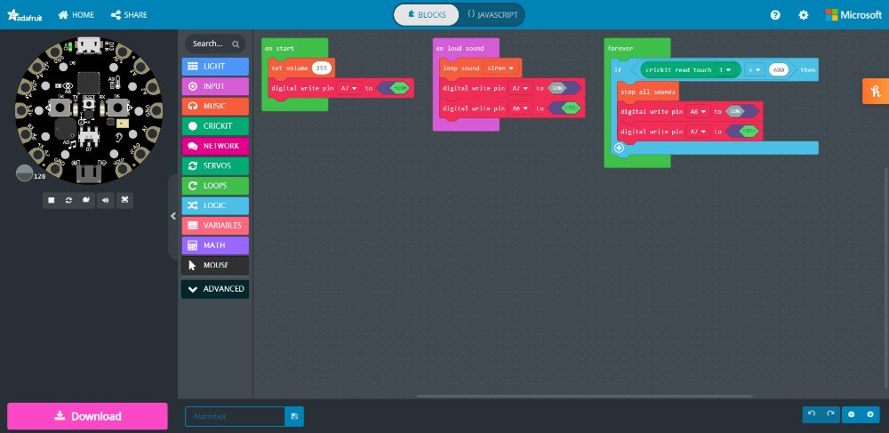
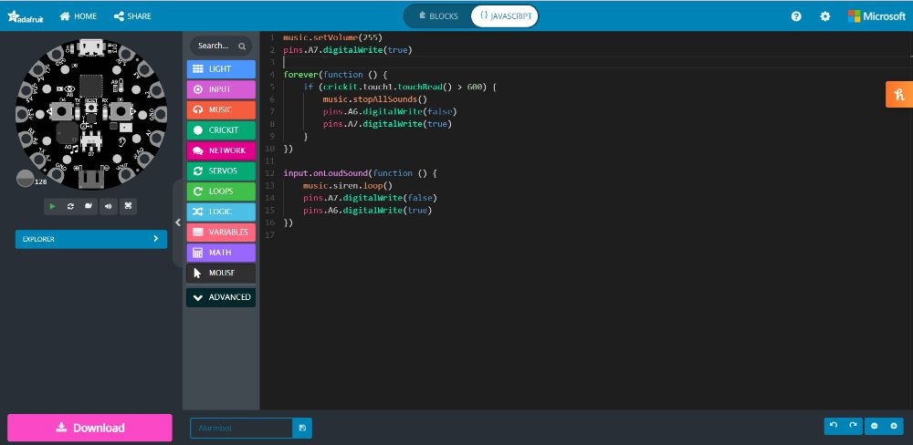
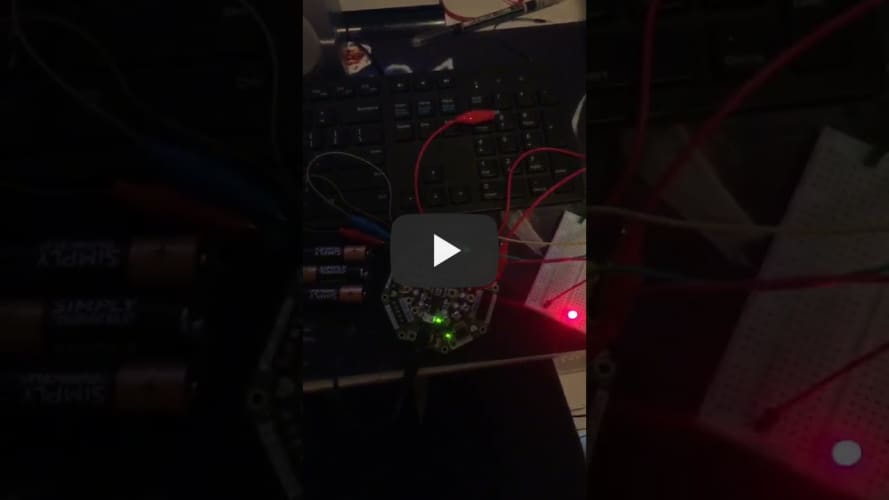
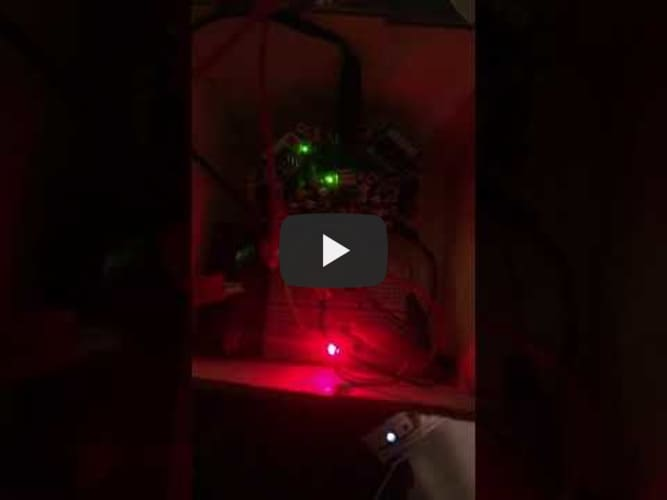
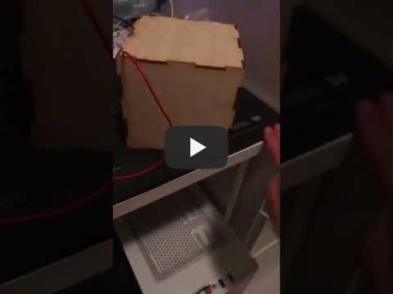

## Hardware programmeren

## Externe electronica aansluiten

## Bruikbaar product
---

**Op dinsdag 6 juli 2021 had je een beoordeling voor dit block. Helaas was het nog niet voldoende. Noteer hierboven, bij de uitdaging(en) die van toepassing zijn, de aanvulling op de leeswijzer voor de herkansing. Neem hierin de feedback van de eerdere poging mee.**

**Laat de inhoud hieronder staan:**

## Hardware programmeren
In mijn interactief project heb ik gebruik gemaakt van de Circuit Playground Rxpress in combinatie met de Crickit voor de Circuit Playground Express. In mijn project leest de circuit playground de input van de geluid sensor. Mijn Circuit Playground Express stuurt ook outputs aan naar een breadboard en een piezo speaker. De Circuit Playground Express kan je programmeren met block code van Microsoft MakeCode, Javascript of python. In mijn project heb ik gebruik gemaak van de MakeCode blokken. 

### Mijn code:

## Externe elektronica aansluiten
Op mijn project word gebruik gemaakt van externe outputs, twee LEDS die aangevoerd worden door een breadboard en een piezo speaker. Er word gebruik gemaakt van een externe omdat de touch input van mijn project gelezen word, de touch input is aangesloten aan de Crickit. 

Bruikbaar product
Ik heb voor mijn product een houten doos gemaakt door een stuk hout te lasercutten in het stadslab. Meeste bedrading is verborgen, er is alleen een kabel voor de touch input zichtbaar. Alle gevoelige elektronica is verborgen, de microcontroller, de power supply en de breadboard zitten veilig in de doos. Het idee van mijn project is om kwetsbare ouderen te helpen, door middel van een alarm. Als ouderen zouden vallen of in veel pijn of in het algemeen hulp nodig hebben kunnen ze een luid geluid maken zodat het alarm af gaat. Verder als het probleem is opgelost of het was een vals alarm kan de alligator clip aangeraakt worden om het alarm te stoppen. Mijn inspiratie is een apparaat zoals de life call. Het product laat dus een alarm af spelen via de piezo speaker die aangesloten is op de Crickit, als het een luid geluid hoort ook wordt er een rode LED verlicht. Verder als de Circuit Playground Express via de touch sensor van de Crickit een waarde die groter dan 600 is leest, word de rode LED uit gezet en de groene LED gaat aan ook worden alle geluiden van de Circuit Playground express gestopt.

