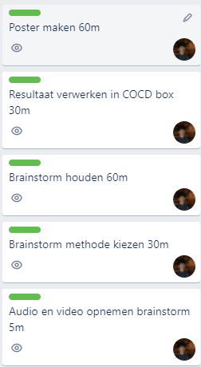
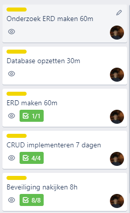

# Being-a-boss
---
## Debriefing
**De opdracht wordt geverifieerd door in eigen woorden te beschrijven wat jij begrepen hebt naar aanleiding van de gesprekken met de opdrachtgever.**

Ik heb de debriefing face to face gehouden op locatie en daar een audio opname van gemaakt. Verder heb ik voor de handtekening van mijn opdrachtgever gevraagd.  Vervolgens heb ik de debriefing opnieuw geluisterd en overgeschreven naar de debriefing template van vorig jaar.

Hier volgt de debriefing:

# Debrief
| Klant naam | Tang |
| ----------- | ----------- |

| Contactpersoon klant | Tang |
| ----------- | ----------- |

| Contactpersoon team | Zino Schubert |
| ----------- | ----------- |

| Project naam | SET website |
| ----------- | ----------- |

| Datum | 17/11/2021 |
| ----------- | ----------- |

## 1. Achtergrond van de opdrachtgever
Meneer Tang is al 5 jaar werkzaam als de eigenaar van SET noodle hotpot Rotterdam.

## 2. Project details
Een website met een reserveringspagina. Het doel van de website is om mensen meer over SET te laten weten en het makkelijk maken om te reserveren. Er moet echter wel nog een een domeinnaam en een server geregeld worden voor de site.

 ## 3. Doelgroep
De site moet voor jong en oud zijn. Hij moet makkelijk te gebruiken zijn en toegankelijk, ook moet de site gebruikelijk zijn op mobiel.

## 4.  Concurrenten
All you can eat tenten zoals Shabu Shabu, Sumo. SET biedt hele snelle service, het is een soort fast food concept voor de Japanse keuken.

 ## 5. Look & Feel
SET moet een mix zijn van en traditioneel Japans

## 6. Details
De site moet niet te zwaar zijn (de site moet snel kunnen laden op de telefoon en op desktop). De site moet ook makkelijk navigeerbaar zijn, niet te veel knoppen.

## 7. Mensen
Er wordt gewerkt met de opdrachtgever meneer Tang, hij wordt betrokken door middel van updates via WhatsApp. Verder is het belangrijk om klanten te betrekken bij het ontwikkelen van de site. De site wordt immers op hun gericht, we kunnen de klanten betrekken via interviews of via testen. 
	
 ## 8. Planning & Budget
De deadline is 19 januari en er komt in december een update van onze voortgang.

---
## Middelen
**Je bent in staat inzicht te geven in de middelen die je nodig hebt om tot een eindproduct te komen.**

Om tot het eindproduct te komen heeft mijn team toegang nodig tot de volgende middelen.

- Laptops
- Text editor/ IDE
- Trello
- GitHub
  
  Dit zijn de basis middelen die we nodig hebben om tot het eindproduct te komen. We hoeven alleen maar te programmeren en daar is alleen een laptop met een text editor voor vereist. Verder maken we gebruik van Trello voor de planning onderling eb GitHub voor het oplsaan van het project. Alle middelen zijn al in het bezit van het team en er zijn geen geld kosten nodig om tot het eindproduct te komen. 

  Apart van de tools waarmee mijn team werkt hebben we ook middelen zoals feedback van de opdrachtgever en kennis van onze programmeer talen nodig.

---
## Risico's 
**Je bent in staat risico’s binnen het proces te benoemen en bijbehorende maatregelen te beschrijven.**

### Niet genoeg technologische kennis
Als mijn teamgenoot en ik niet genoeg kennis bezitten van de technologieën die we willen gebruiken gaat het vrijwel onmogelijk zijn om het eindproduct te maken. Dit risico kan onstaan door een gebrek aan onderzoek. Om te voorkomen dat mijn team niet genoeg technologische kennis bezit volgen wij allebei de programmeer lessen.

### Niet genoeg tijd / Optimistische planning
Het ontwerpen van een site met een reserveringssysteem is voor mijn team iets waar we nog niet veel ervaring mee hebben. Dit zorgt ervoor dat de planning van mijn team misschien niet helemaal realistisch of haalbaar is. Dit kan erin resulteren dat wij de deadline van het project missen. Om dit te voorkomen zorgen we ervoor dat we in meerdere sprints werken, achteruit plannen en dat we ook flexibel plannen. Verder werken we in Trello zodat we beter om elkaar heen kun plannen en kunnen zien waar we allebei mee bezig zijn.

### Product voldoet niet aan verwachting
Het zou kunnen dat wij denken dat het product af is terwijl de opdrachtgever ontevreden is met het eind product. Dit kan onstaan doordat wij als team en de opdrachtgever een ander beeld hadden van de opdracht. Wij kunnen dit voorkomen met behulp van de debrief maar ook met regelmatig contact tussen ons team en de opdrachtgever. Dit zorgt ervoor dat de opdrachtgever weet hoe het project voor uit gaat maar ook hoe het project zicht vormt.

### Data verlies
Als er een ongeluk zou gebeuren bij de 1 van de laptops van ons team zou dat ervoor kunnen zorgen dat wij een groot onderdeel van het eindproduct verliezen. Om dit te voorkomen kunnen wij al ons werk uploaden naar GitHub. Dit zorgt ervoor dat we efficiënter samen kunnen werken doordat we altijd starten waar iemand het laatst is gestopt en al ons werk word veilig bewaard.

---
## Procesplanning
**Je bent in staat inzicht te geven in de stappen die moeten worden genomen en de tijd die het kost om tot een eindproduct te komen.**

### Sprint 1
Het project startte zich natuurlijk met een debriefing tussen mij en de opdrachtgever. Daarna heb ik de opdracht gedeeld met mijn team genoot en zijn wij begonnen met het maken van taken. Deze hebben taken we hebben toen over geplaatst naar onze werkomgeving in Trello, zodat we konden beginnen met het plannen. We hebben achteruit gepland, niet alleen werkten we aan het eindproduct maar ook aan andere building blocks. In de eerste sprint ben ik te werk gegaan aan mijn concepten building block. Ik heb dus een brainstorm ingepland, tijd genomen voor onderzoek in welke brainstorm methode ik wilde gebruiken en ik heb tijd vrij gemaakt voor het maken van een poster. Mijn team genoot is gaan werken aan een building block van vorig jaar.

### Sprint 2
Ik heb besloten om deze sprint te beginnen aan het maken van het reserveringssysteem. Ik heb beide programmeer cursussen gevolgd wat wel een beetje zwaar was. Het is mij gelukt om de CRUD functionaliteiten toe te voegen. We waren niet verder dan dat gekomen in de lessen. Mijn teamgenoot is begonnen aan haar content block en was gaan werken aan de homepage van de site. We hebben deze maand een update gegeven aan de opdrachtgever, door wat feedback weet ik ook dat de opdrachtgever het een leuk idee vond om te kunnen reserveren via een tafel weergave. 

### Sprint 3
Ik heb de laatse onderdelen zoals beveiliging toegevoegd en ik heb reserveren vie een tafel weergave bijna volledig toegevoegd. De rest van de site is wel helemaal af. Je kan wel reserveren op de site via een formulier. Mijn teamgenoot is gaan werken aan haar concepten block van vorig jaar. 

---
## Communicatieplanning
**Je bent in staat je eigen werkzaamheden en je voortgang regelmatig te bespreken (bijv. met een project coach, product owner, opdrachtgever of teamleden), zodat tijdig bijgestuurd kan worden.**

Ik heb mijn opdrachtgever bij debriefing in het echt gesproken en ik voor feedback gevraagd over WhatsApp. Verder heb ik elke CLE dag met mijn teamgenoot een kleine standup gehouden op school waar we gingen vertellen waar de die dag aan gingen werken. 

Ik ben tevreden met mijn eigen werkzaamheid. Het is mij gelukt om 3 building blocks te voltooien(inclusief deze). Verder is het mij bijna helemaal gelukt om mij aan de planning te houden. Ik hoop dat ik dit ritme over kan brengen naar de 3e periode. 