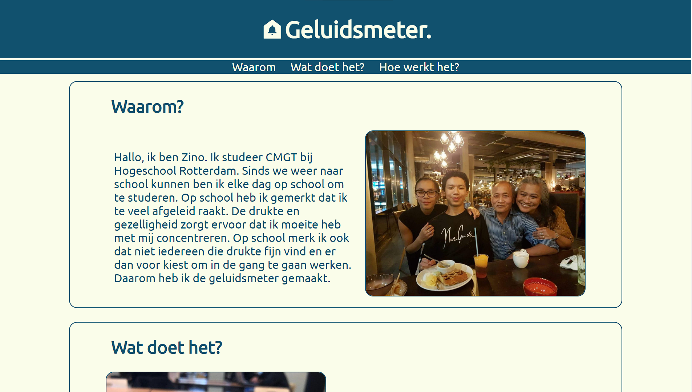
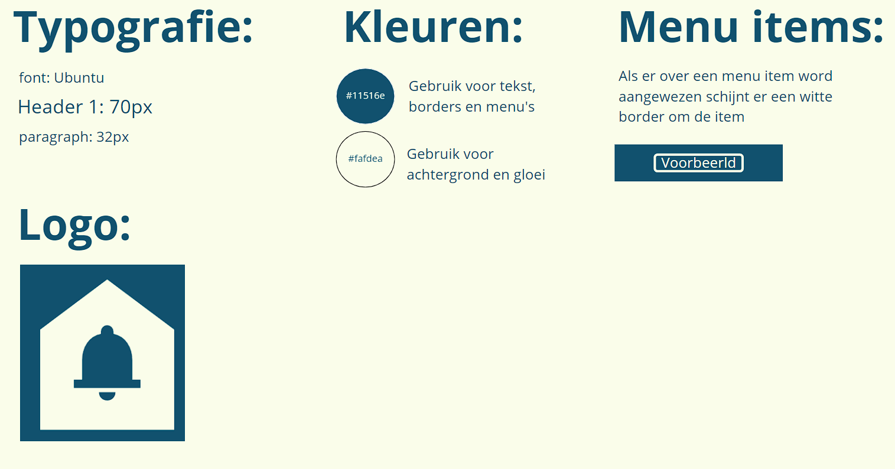
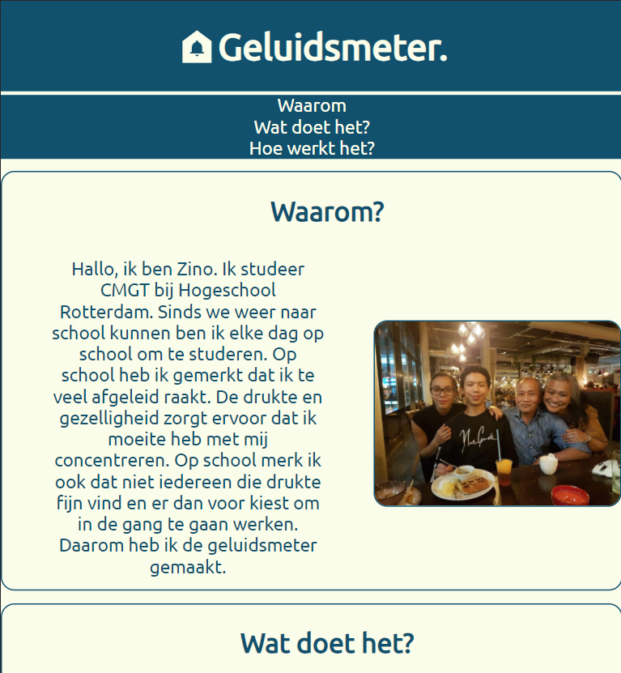
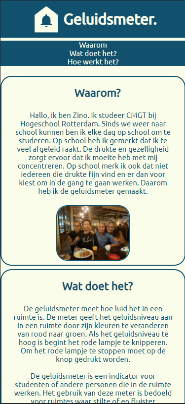

# Afstemming
https://stud.hosted.hr.nl/1010115/one-pager/

Mijn product is een geluidsmeter. Hij kan gebruikt worden in ruimtes waar je een bepaalt niveau van geluid wilt behouden. Bijvoorbeeld bibliotheken, klaslokalen en in studieruimtes.
In deze omgevingen laat hij zien of het geluid op het gewenste niveau zit, er net over zit of dat het geluid te luid is. Indien het gelduid te luid is begint er een rood lampje te knipperen. 

Mijn geluidsmeter is voor werkruimtes en daarom probeer ik de content rond mijn geluidsmeter op professionelen af te stemmen. Een one pager past goed bij mijn product en het publiek omdat je kort en overzichtelijk kan lezen over wat het product doet en waar hij voor bedoeld is.

# Doelgroep

Qua onderzoek naar het doelgroep heb ik gekeken naar hoe andere bedrijven marketen naar mijn doelgroep. Als doelgroep heb ik onderwijsinstellingen gekozen. Ik heb gekeken naar wat voor taal er word gebruikt, welke kleuren er worden gebruikt en de lay-out van de sites. 

# Visuals

Ik heb voor de kleuren wit en blauw gekozen. Ik heb deze kleuren gekozen voor het psychologische effect die deze kleuren kunnen hebben. De kleur wit word gebruikt om een puur en schoon gevoel te geven, iets wat ik wil creëeren door de werkomgeving te verbeteren. De kleur blauw helpt met productiviteit, de kleur blauw kan ook een kalmerend gevoel opwekken en een gevoel van vertrouwen. 

Ik heb het Ubuntu lettertype gekozen. Het Ubuntu lettertype is familie van de Sans-Serif fonts. De Sans-Serif fonts behoren tot de meest leesbare fonts. 

Qua beelden heb ik een foto van de behuizing van de geluidsmeter gekozen zodat er een beeld is van hoe het product er uit ziet. Verder heb ik een foto van mij en mijn famillie om te laten zien door wie het gemaakt is.

Ook zijn er links naar platformen waar ik bereikbaar ben

Hier is mijn style guide:

# Helder
Ik heb mijn one pager bijna volledig in het Nederlands geschreven en ik heb de taal gebruik en de spelling laten na kijken.

# Digitaal toegankelijk
Mijn website is te bereiken op mijn studenten site van de hogeschool. Verder heb ik mijn site zo gemaakt dat hij goed leesbaar is op verschillende devices en dat mensen die gebruik maken van screen readers ook gebruik kunnen maken van de site. Ook kan je over de site volledig navigeren met een toetsenboord. 

Ipad weergave:

Iphone weergave:
