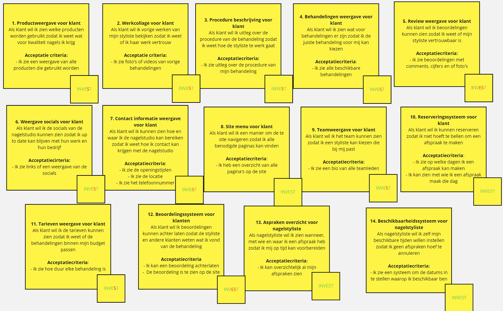

# Interactie Ontwerpen
## User Stories

Mijn user stories bevatten veel stories die te klein zij, het zijn geen dingen die de site per se nodig heeft om te werke. Maar ze zijn wel waardevol en zouden de gebruikservaring en de functionele waarde van de site verbeteren. Verder is er een story over een review systeem, onze groep heeft hier nog geen ervaring mee we kunnen dus niet inschatten hoelang het zou duren om zo een systeem te maken. Het maken van de site menu is geen kleine taak, omdat bij het maken van een goeie site menu er taken komen zoals een site map maken. 
## MoSCoW
|Must haves|Should Haves|Could Haves|Would Haves|
|---|---|---|---|
|8. Site menu voor klant |4. Behandeling weergave voor klant | 1. Productweergave voor klant|5. Review weergave vooor klant  |
|10. Reserveringssysteem voor klant |7. Contact informatie weergave voor klant |2. Werkcollage voor klant | |
|13. Afspraken overzicht voor nagelstyliste |11. Tarieven weergave voor klant |3. Procedure beschrijving voor klant | |
|14. Beschikbaarheidssysteem voor nagelstyliste |  |6. Weergave socials voor klant ||
| | |9. Teamweergave voor klant | |
| | |12.Beoordelingssysteem klanten | |
## Sitemap
