# Interactie Ontwerpen
## User Stories

Mijn user stories bevatten veel stories die te klein zij, het zijn geen dingen die de site per se nodig heeft om te werke. Maar ze zijn wel waardevol en zouden de gebruikservaring en de functionele waarde van de site verbeteren. Ook zouden sommige van deze kleine user stories samengevoegd kunnen worden bijvoorbeeld zouden de procedure weergave en de behandelingen weergave één story kunnen worden omdat elke behandeling een andere procedure heeft, het kunnen zien van de procedure word dan een een DoD voor de story. Ook zie ik dit terug bij de socials story en de contact story maar ook de story van de behandelingen en de prijzen kunnen samengevoegd worden.
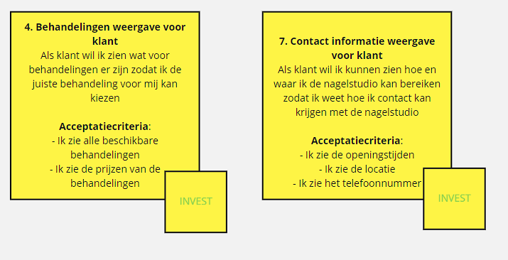 Verder is er een story over een review systeem, onze groep heeft hier nog geen ervaring mee we kunnen dus niet inschatten hoelang het zou duren om zo een systeem te maken. Het maken van de site menu is geen kleine taak, omdat bij het maken van een goeie site menu er taken komen zoals een site map maken. 
## MoSCoW
|Must haves|Should Haves|Could Haves|Would Haves|
|---|---|---|---|
|8. Site menu voor klant | | 1. Productweergave voor klant|5. Review weergave vooor klant  |
|10. Reserveringssysteem voor klant | |2. Werkcollage voor klant | |
|13. Afspraken overzicht voor nagelstyliste | |9. Teamweergave voor klant | |
|14. Beschikbaarheidssysteem voor nagelstyliste |  |12.Beoordelingssysteem klanten | |
|4. Behandeling weergave voor klant | | | |
|7. Contact informatie weergave voor klant | | | |
## Sitemap
### Context
Nelcey beauty is een nagelstudio die specialiseert in BIAB behandelingen. Er werken twee stylisten en er word gewerkt op twee locaties. Nelcey beauty is een net nieuw bedrijf. Ze hebben nog geen site en ze namen reserveringen aan via Instagram direct messages.  
### Content
Nelcey beauty beschikt momenteel alleen over een Instagram page, die de certificaten van de styliste toont. In de debriefing is wel duidelijk gemaakt de tone-of-voice van de site "gewoon"moet zijn. Nelcey beauty vind het ook belangrijk dat de site goed weergeeft dat je BIAB behandelingen kan doen bij hun.
### Gebruikers
Nelcey beauty focust zich op mensen die een BIAB behandeling willen voor hun nagels. Verder promoten ze de BIAB behandeling als een behandeling die voor gezonde en natuurlijke nagels zorgt. Mensen die dus ongezonde nagels hebben of hun nagels gezond willen houden zouden dus interesse hebben in een BIAB behandeling. Nelcey beauty wil dat je via de site bij hun een behandeling kan reserveren.
### HIFI sitemap
Ik was begonnen met de card sorting test zelf te doen maar heb het ook getest bij andere mensen omdat ik zelf niet van de doelgroep ben.
- Dit zijn de kaarten voor de card sorting test
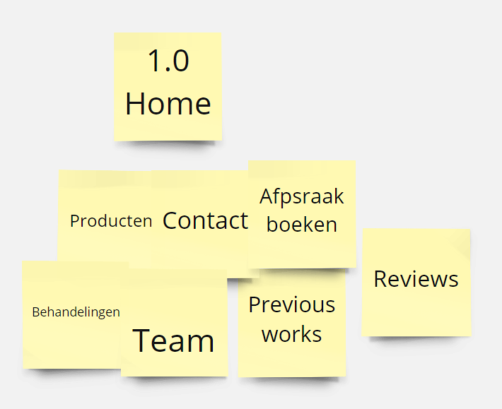
- Dit is mijn lofi sitemap
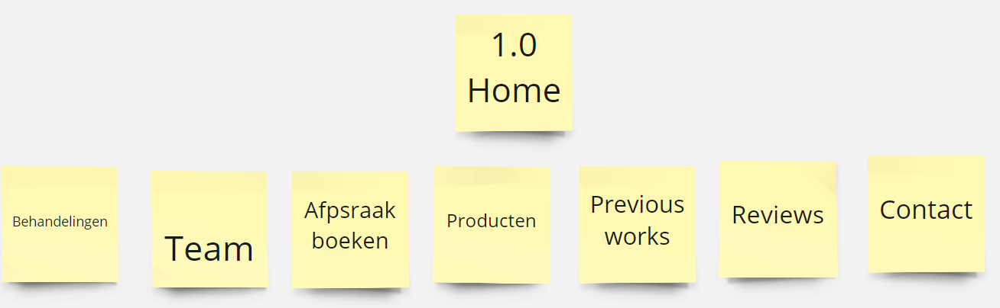
 bij het maken van deze sitemap heb ik de info die ik vind dat de klant het meest zou waarderen voordat ze een afspraak zouden willen boeken het meest links gezet zodat ze dat als eerste zien, daarna komt de overige info en contact als laatst omdat ik gewend ben om de contact sectie ergens helemaal rechts te zien,
- mijn hifi sitemap (niet de final hifi sitemap)
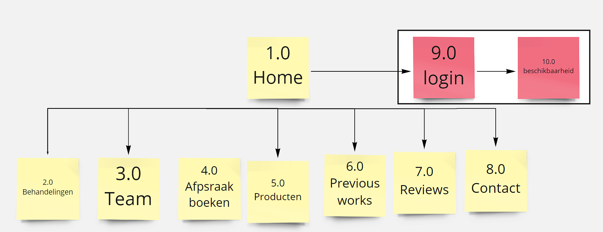
- lofi sitemap van de card sorting test 1 (klik op de foto voor de video)
[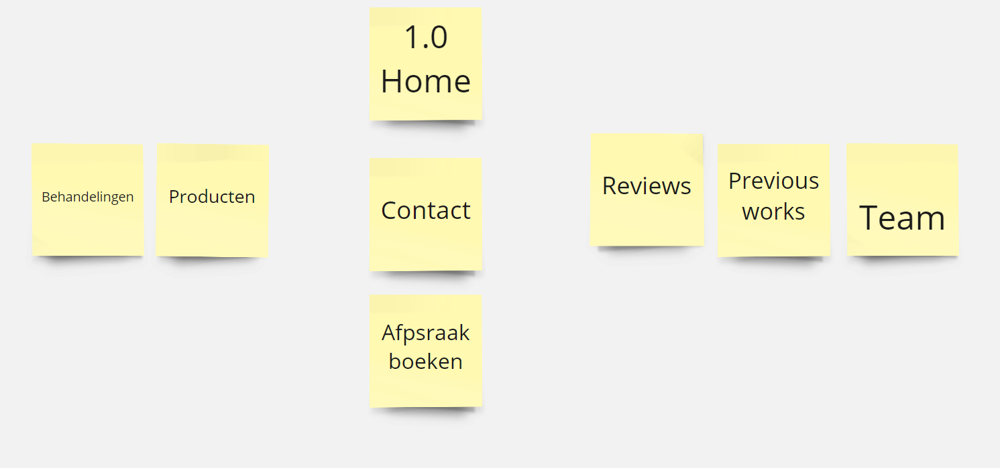](https://youtu.be/ihewCyo9tvs)
Uit deze card sorting test heb ik een heel ander perspectief gezien, voor deze gebruiker zou klinkt het logischer om het boeken te doen na het zien van de contact pagina. Verder vond hij dat previous works en reviews op dezelfde pagina konden. 
- lofi sitemap van card sort test 2 (foto linkt weer naar een video)
[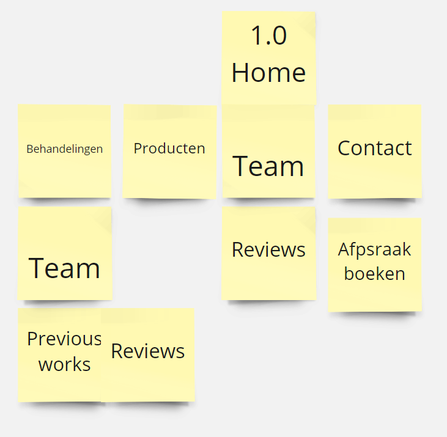](https://youtu.be/_9Hk4XDuk4U)
 Deze card sort was gedaan met een medestudent zij heeft geen ervaring met naar een nagelstudio gaan maar ook uit deze test heb ik een nieuw perspectief gezien. Zij vond het dus interessant als je vanaf behandelingen kon zien welke teamleden die behandelingen deden en vanaf de team pagina kon zien wat voor werken elk team member had en vanaf daar naar de reviews.
- lofi sitemap van card osrt test 3(video op foto)
[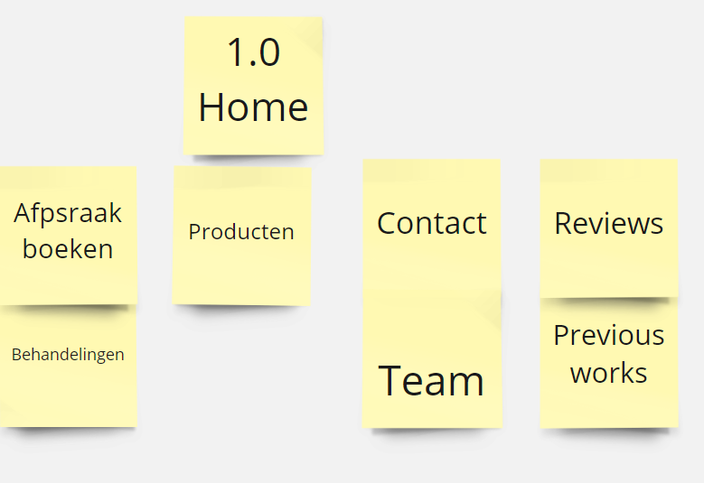](https://youtu.be/Boffg_8zjdE)
Bij deze card sort was er dus een focus ophet verkopen van de service.
- Final hifi sitemap
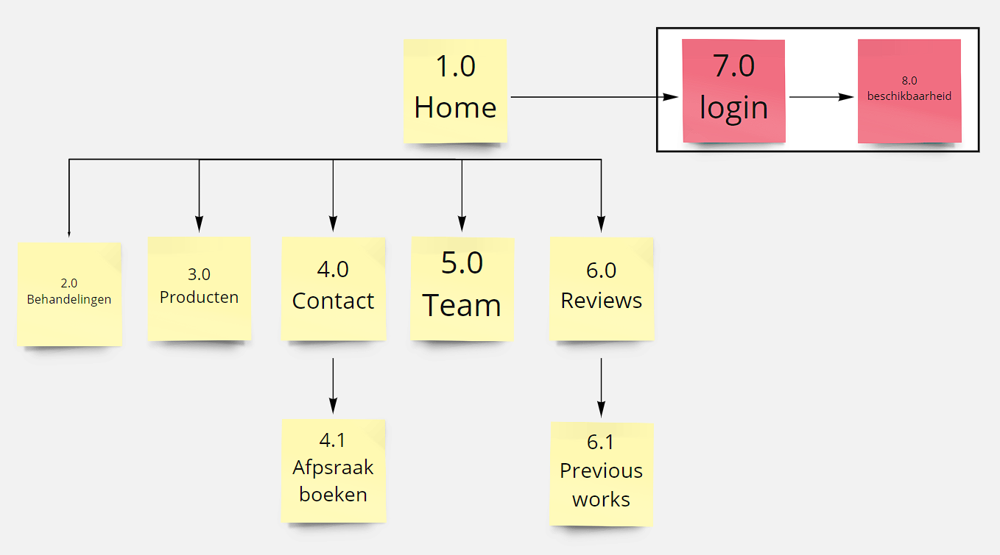
Met alle info die ik heb verzameld van de tests is dit de hifi sitemap die ik heb gemaakt. Zo heb ik de behandelingen helemaal links gehouden en bijvoorbeeld het boeken van afspraken gezet onder contact. Als laatst heb ik de reviews en prevous workshops met elkaat gelinkt.

## Wireframes
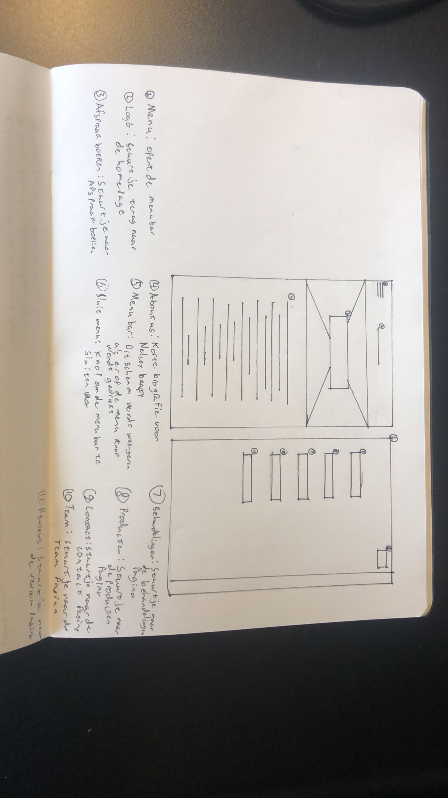
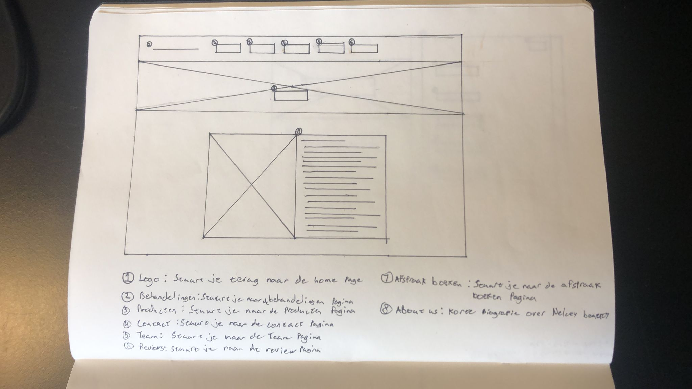
Ik heb 2 low fi wireframes gemaakt voor de homepage. Eentje voor op de mobiel en één voor op een desktop. Daarna heb ik aanbevelingen gevraagd van een studie genoot 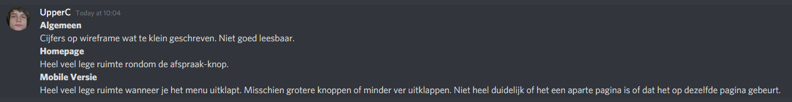
Met deze feedback in gedacht heb ik de hi fi wireframes gemaakt.
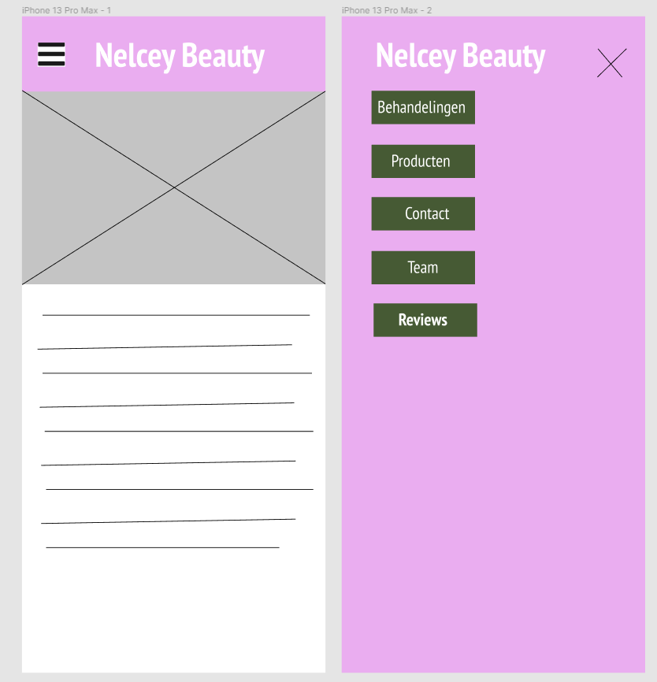
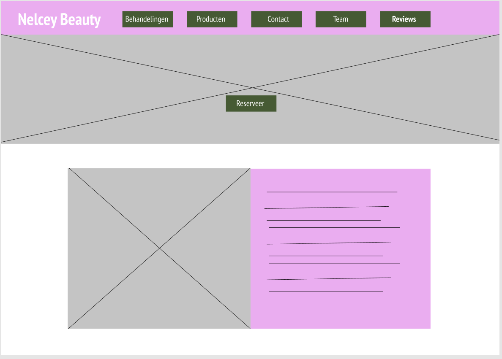

## Style guide
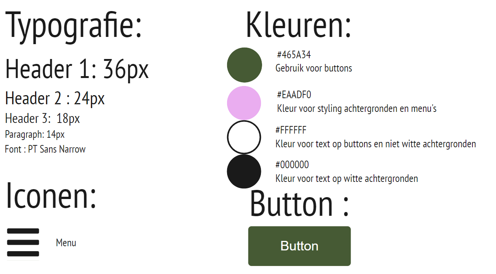
Er was al een debriefing geweest met onze opdrachtgever uit deze debriefing heb ik gehaald dat ze een "gewone" tone of voice wilt gebruiken voor de website en ze wilde dat de kleuren mosgroen en lila in de site terugkomen. De site is vooral bedoeld voor het maken van een afspraak

## Debriefing

